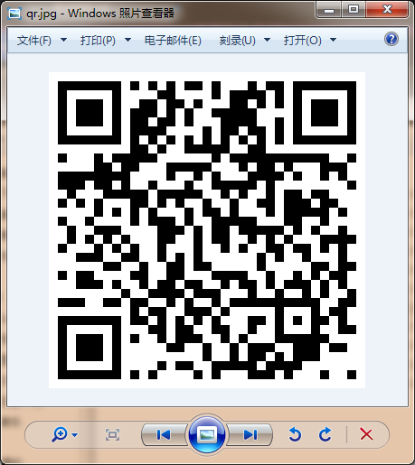
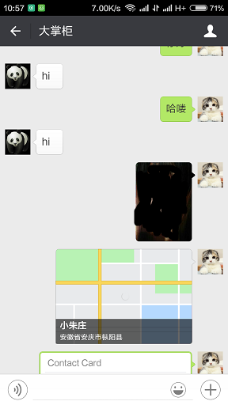
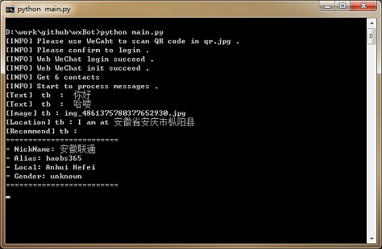

# wxBot [](http://github.com/liuwons/wxBot) [](http://github.com/liuwons/wxBot/fork) 

Python包装Web微信实现的微信机器人框架。可以很容易地实现微信机器人。

## 环境与依赖

目前只能运行于Windows下的Python 2环境 。
**wxBot** 用到了Python **requests** 和 **pyqrcode** 库，使用之前需要安装这两个库:

```bash
pip install requests
pip install pyqrcode
```

## 快速开发
### 代码

利用 **wxBot** 最简单的方法就是继承WXBot类并实现handle_msg_all或者schedule函数，然后实例化子类并run，如下的代码对所有的文本消息回复 "hi"， 并不断向好友tb发送"schedule"。
handle_msg_all函数用于处理收到的每条消息，而schedule函数可以做一些任务性的事情(例如不断向好友推送信息或者一些定时任务)。

```python
#!/usr/bin/env python
# coding: utf-8

import time
from wxbot import *

class MyWXBot(WXBot):
    def handle_msg_all(self, msg):
        if msg['msg_type_id'] == 5:
            self.send_msg(msg['user_name'], 'hi')

    def schedule(self):
        self.send_msg('tb', 'schedule')
        time.sleep(1)

def main():
    bot = MyWXBot()
    bot.DEBUG = True
    bot.run()

if __name__ == '__main__':
    main()

```

### 运行

直接用python运行代码(如运行测试代码test.py):

``` python
python test.py
```

### 登录微信

程序运行之后，会在当前目录下生成二维码图片文件 qr.jpg ，用微信扫描此二维码并按操作指示确认登录网页微信。




## 效果展示

测试代码test.py的运行效果：





## 接口
### handle_msg_all

handle_msg_all函数的参数msg是代表一条消息的字典。一般包含以下字段：

| 字段名 | 意义 |
| ----- | --- |
| msg_id | 消息id，微信内部数据 |
| msg_type_id | 消息类型，具体见消息类型表 |
| user_id | 发送消息的用户的id，微信内部数据 |
| user_name | 发送消息的用户的名字，为备注名或者微信用户名 |
| content | 消息体，不同类型消息的此字段内容不同，具体见消息类型表 |

消息类型表：

| 类型号 | 类型名称 | 类型描述 | content |
| ------ | ------- | --- | -------- |
| 1 | Location | 位置 | 字典,包含location(位置的文本描述)和xml(原始未解析的xml格式文本)字段 |
| 2 | FileHelper | 文件 | 字符串,文本文件内容 |
| 3 | Self | 自己发送的消息 | 字符串，文本消息 |
| 4 | Group | 群消息 | 字典，包含group_id(微信内部id), group_name(群名), user(微信内部id), user_name(用户名称), msg(字符串消息)字段 |
| 5 | Text | 普通文本消息 | 字符串， 文本消息 |
| 6 | Image | 图片 | 字符串， 图片url |
| 7 | Voice | 语音 | 字符串， 语音url |
| 8 | Recommend | 微信名片 | 字典， 包含nickname(昵称)，alias(别名)，province(省份)，city(城市)， gender(性别)字段 |
| 9 | Animation | 动画 | 字符串， 动画url |
| 10 | Share | 分享 | 字典，包含type(类型)，title(标题)，desc(描述)，url(链接)，from(来自)字段 |
| 11 | Video | 视频 | 字符串，未解析的xml字符串 |
| 12 | VideoCall | 视频电话 | 字符串，未解析的xml字符串 |
| 13 | Redraw | 撤回消息 | 字符串，未解析的xml字符串 |
| 14 | Init | 微信初始化系统消息，可以忽略 | 字符串，未解析的xml字符串 |
| 99 | Unknown | 未知类型 | 字符串，未解析的xml字符串 |

### WXBot对象属性

WXBot对象在登录并初始化之后,含有以下的可用数据:

| 属性 | 描述 |
| ---- | ---- |
| contact_list | 当前用户的微信联系人列表 |
| group_list | 当前用户的微信群列表 |
| session | WXBot与WEB微信服务器端交互所用的requests Session对象 |

WXBot对象还含有一些可以利用的方法：

| 方法 | 描述 |
| ---- | --- |
| get_icon(id) | 获取用户icon并保存到本地文件 img_[id].jpg ,id为用户id(Web微信数据) |
| get_head_img(id) | 获取用户头像并保存到本地文件 img_[id].jpg，id为用户id(Web微信数据) |
| get_msg_img(msgid) | 获取图像消息并保存到本地文件 img_[msgid].jpg, msgid为消息id(Web微信数据) |
| get_voice(msgid) | 获取语音消息并保存到本地文件 voice_[msgid].mp3, msgid为消息id(Web微信数据) |
| get_user_remark_name(uid) | 获取好友的备注名，没有备注名则获取好友微信号， uid为好友的用户id(Web微信数据) |
| send_msg_by_uid(word, dst) | 向好友发送消息，word为消息字符串，dst为好友用户id(Web微信数据) |
| send_msg(name, word, isfile) | 向好友发送消息，name为好友的备注名或者好友微信号，isfile为False时word为消息，isfile为True时word为文件路径(此时向好友发送文件里的每一行) |
